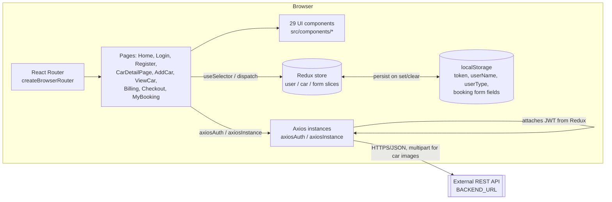
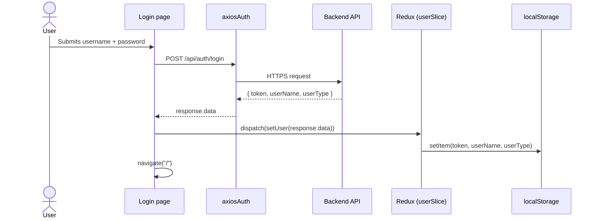

# Architecture

## System overview

This repo is a browser-only React SPA. There is no server code, no database, and no build-time
API proxy here — every data operation goes out over HTTP to a separately deployed backend, using
two preconfigured Axios instances (`axiosAuth` for login/register, `axiosInstance` for everything
else, with a JWT attached via request interceptor). Client-side state splits into ephemeral UI
state (component `useState`) and cross-page state kept in Redux (auth token/user, in-progress car
image list, multi-step booking form data) — the auth and booking-form slices also mirror
themselves into `localStorage` so a page refresh doesn't lose the session or an in-progress
booking.

Routing is a single `createBrowserRouter` tree (`src/utils/Router.jsx`). Most interior routes are
wrapped in a custom `ProtectedRoute` that reads the Redux token and redirects to `/login` if it's
missing — there's no server-side auth check on the frontend itself beyond that.

## Architecture diagram

There is no database layer in this repo — all persistence lives behind `BACKEND_URL`, which
points to `https://testing-tagname.onrender.com` in `src/utils/constants.jsx`. That hostname
("testing-tagname") and the fact that this repo has sibling repos `car-rental-backend` and
`car-rental-jar` suggest this frontend is meant to pair with one of those as its API — nothing in
this repo's code names either sibling directly, so the exact pairing should be confirmed from
whichever backend repo actually exposes `/api/auth`, `/api/cars`, `/api/bookings`, and
`/api/users/expired`.

## Request flow: login

## Folder-by-folder breakdown

| Path | What's there | Why |
|---|---|---|
| `src/pages/` | 9 route-level screens (`Home`, `Login`, `Register`, `CarDetailPage`, `AddCar`, `ViewCar`, `Billing`, `Checkout`, `MyBooking`) | One file per route registered in `src/utils/Router.jsx`; each composes components and owns its own data fetching |
| `src/components/` | 29 component folders (e.g. `CarCard`, `Header`, `Sidebar`, `BillingForms`, `AddCarForm`, `CarImages`, `Carousel`) | Reusable UI pieces, one folder per component, consumed by pages |
| `src/components/Testing/` | A near-duplicate of `AddCarForm` with a no-op submit handler | Leftover dev scaffold, still mounted at `/testing` — see Known Issues |
| `src/utils/axios.jsx` | `axiosAuth` (baseURL `${BACKEND_URL}/api/auth`) and `axiosInstance` (baseURL `${BACKEND_URL}/api`, JWT request interceptor reading `store.getState().user.token`) | Centralizes API base URLs and auth header injection so pages don't repeat it |
| `src/utils/constants.jsx` | `BACKEND_URL` string constant | The only place the API host is configured — not an env var |
| `src/utils/Router.jsx` | Full route tree, `ProtectedRoute` wrapping for gated pages | Single source of truth for navigation |
| `src/utils/ProtectedRoute.jsx` | Redirects to `/login` when `state.user.token` is falsy | Client-side-only route guard |
| `src/utils/store/store.jsx` | `configureStore` wiring `user`, `car`, `form` reducers | Redux Toolkit store setup |
| `src/utils/slices/` | `userSlice` (auth + `localStorage` mirror), `carSlice` (in-progress car image list), `formDataSlice` (multi-step booking form: location, billing, car id) | Cross-page state that would otherwise need prop-drilling through the router |
| `src/utils/Utility.jsx` | Date/string helpers (`firstCaps`, `dateToString`, `disabledDate`, `validateAndAdjustTimes`, etc.) | Shared formatting/validation logic used by forms |
| `public/` | Static logo/image assets referenced by absolute path (`/logo.svg`, etc.) | Served as-is by Vite/the host |
| `dist/` | Vite production build output | Committed to git — see Known Issues |
| `netlify.toml` / `vercel.json` | SPA rewrite rules (`/* → /index.html`) | Deploy configs for two different static hosts |

## Known issues / limitations

- **Build output committed to git.** `dist/` (compiled JS/CSS/assets) and a Vite internal cache
  file (`.vite/deps_temp_.../package.json`) are tracked in the repository, even though `dist` is
  also listed in `.gitignore` — `git log -- dist` shows it was added, removed, and re-added across
  commits. These should be removed from version control and left to the build step.
- **`App.jsx` calls `fetch(BACKEND_URL)` directly in the component body** (not inside `useEffect`),
  so it fires as a side effect on every render with no error handling and an unused response —
  likely leftover debug/health-check code.
- **`App.jsx`'s token check is always true:** `if (token !== null || token !== undefined)` uses
  `||` where `&&` was intended, so `validateToken()`'s API call (`POST /api/users/expired`) runs
  even when there is no token at all.
- **`formDataSlice` stores objects into `localStorage` without serializing them** (e.g.
  `localStorage.setItem("billingForm", action.payload)` where `action.payload` is an object) —
  this writes the literal string `"[object Object]"` instead of usable JSON, so the
  `localStorage`-backed initial state for `billingForm`/`locationForm` is not actually
  recoverable across a page reload.
- **`src/components/Testing/Testing.jsx` is a stale duplicate of `AddCarForm`**, exported under
  the same component name, with a submit handler that does nothing (`onFinish = (values) => {}`).
  It's still wired into the router at `/testing` (imported in `Router.jsx` as `AddCarForm`),
  which is confusing given the real, functional `AddCarForm` component already exists and is used
  on `/add-car`.
- **No automated tests and no CI.** No test files, no `.github/workflows`, and `npm test` isn't
  defined in `package.json` — only `lint`, `dev`, `build`, `preview`.
- **API host is hardcoded**, not driven by an environment variable, so switching backends (e.g.
  local dev vs. the sibling `car-rental-backend`/`car-rental-jar` repos) requires editing
  `src/utils/constants.jsx` directly.
